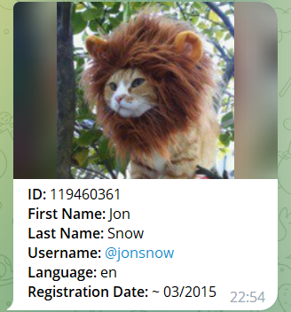

# pyInspectorTelegramBot
Telegram bot working in groups and channels. Sends available information about new members (ID, First Name, Last Name, Username, Language Code, Premium Status, Profile Photo and the approximate date of registration) to group administrators.

  

## Installation
As an example, the bot will be installed on a VPS with Ubuntu Server.
- Start the [BotFather](https://t.me/BotFather) bot in Telegram. Create a new bot and get its authorization token.
- Installing the necessary packages, creating a working directory, copying files:

<pre>
user@vps:~$ sudo apt update
user@vps:~$ sudo apt-get install vim logrotate git python3-venv python3-pip
user@vps:~$ git clone https://github.com/rustequal/pyInspectorTelegramBot.git
user@vps:~$ sudo useradd -m -d /opt/inspector-bot -s /bin/bash bot
user@vps:~$ sudo chmod 755 /opt/inspector-bot
user@vps:~$ sudo cp pyInspectorTelegramBot/*.{py,json,txt} /opt/inspector-bot/
user@vps:~$ sudo chown bot:bot /opt/inspector-bot/*.{py,json,txt}
user@vps:~$ sudo cp pyInspectorTelegramBot/redist/etc/systemd/system/inspector-bot.service /etc/systemd/system/
user@vps:~$ sudo cp pyInspectorTelegramBot/redist/etc/logrotate.d/inspector-bot /etc/logrotate.d/
</pre>

- Creating a python environment, installing the necessary python packages:
<pre>
user@vps:~$ sudo su bot
bot@vps:/home/user$ cd
bot@vps:~$ python3 -m venv telegram
bot@vps:~$ source telegram/bin/activate
(telegram) bot@vps:~$ pip3 install -r requirements.txt
</pre>

- Editing the configuration file. It's necessary to set the "token" parameter to the value of the Telegram bot authorization token:
<pre>
(telegram) bot@vps:~$ vim config.json
(telegram) bot@vps:~$ exit
</pre>

- Patching the bug in "pyTelegramBotAPI 4.9.0" library:
<pre>
user@vps:~$ sudo patch /opt/inspector-bot/telegram/lib/python3.10/site-packages/telebot/asyncio_helper.py < pyInspectorTelegramBot/asyncio_helper.patch
</pre>

- Starting the bot service, setting up the autostart of the service, checking the logs:
<pre>
user@vps:~$ sudo systemctl daemon-reload
user@vps:~$ sudo systemctl start inspector-bot
user@vps:~$ sudo systemctl enable inspector-bot
user@vps:~$ sudo tail /opt/inspector-bot/bot.log
</pre>

## Usage
- After starting the bot, you need to set the owner and his password with the "/set_owner" command. With the same command, you can change the owner, as well as change the owner's password. Open a chat with the bot and enter the command:
<pre>
/set_owner &lt;PASSWORD&gt;
</pre>

- Add the bot to the telegram group or channel as an administrator.
- Open the group chat and enter the command "/group_add@username", where "@username" is the username of the new bot:
<pre>
/group_add@username
</pre>

- To add a telegram channel to the bot settings, copy the channel message to the bot's chat. The bot will output the channel ID. Next, use the command "/channel_add" to add the channel to the bot settings:
<pre>
/channel_add &lt;ID&gt;
</pre>

- Wait until a new member joins the group or channel. The bot will send you a message with information about the new member.
- If messages about new members need to be sent to other users, then you need to reply to their messages in the group chat with the "/user_add@username" command to add them as bot users:
<pre>
/user_add@username
</pre>

- To display information about a chat member, use the command "/member" in the bot's chat. The numeric ID of the member must be specified as a parameter:
<pre>
/member &lt;ID&gt;
</pre>

- To get information about the member, you can forward his message to the bot's chat. For example, this way you can find out his ID number. But if his account is hidden by the privacy settings, then you will not be able to do that. In this case, use the command "/member" and its numeric ID, if it is known.
- For help on all commands, use the command "/help" in the bot's chat.
- The list of versions, changes and fixes is available in [CHANGELOG.md](/CHANGELOG.md)

## References

- [pyTelegramBotAPI](https://github.com/eternnoir/pyTelegramBotAPI)
  - A simple, but extensible Python implementation for the [Telegram Bot API](https://core.telegram.org/bots/api).
- [AIOHTTP](https://github.com/aio-libs/aiohttp)
  - Asynchronous HTTP Client/Server for asyncio and Python.
